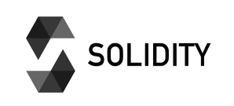
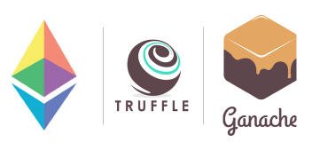

  

# MultisigWallet  

A smart contract implementing a Multisig Wallet for Ethereum Programmed using the [Solidity](https://docs.soliditylang.org/) programming language and the [Truffle Suite and Ganache]((https://www.trufflesuite.com/ganache) development environment.  

